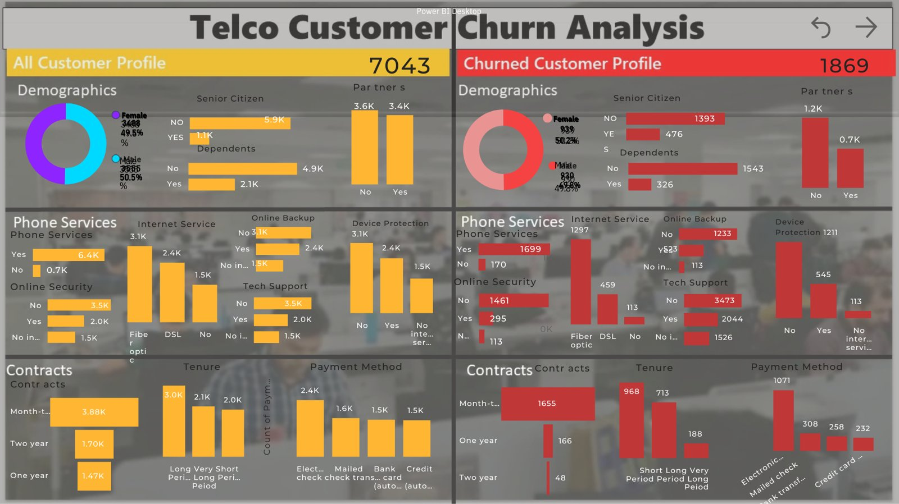
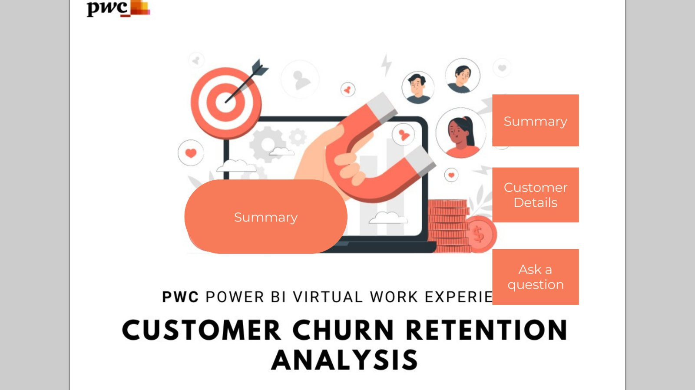
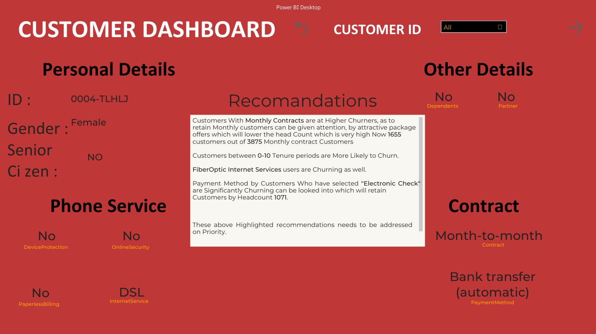
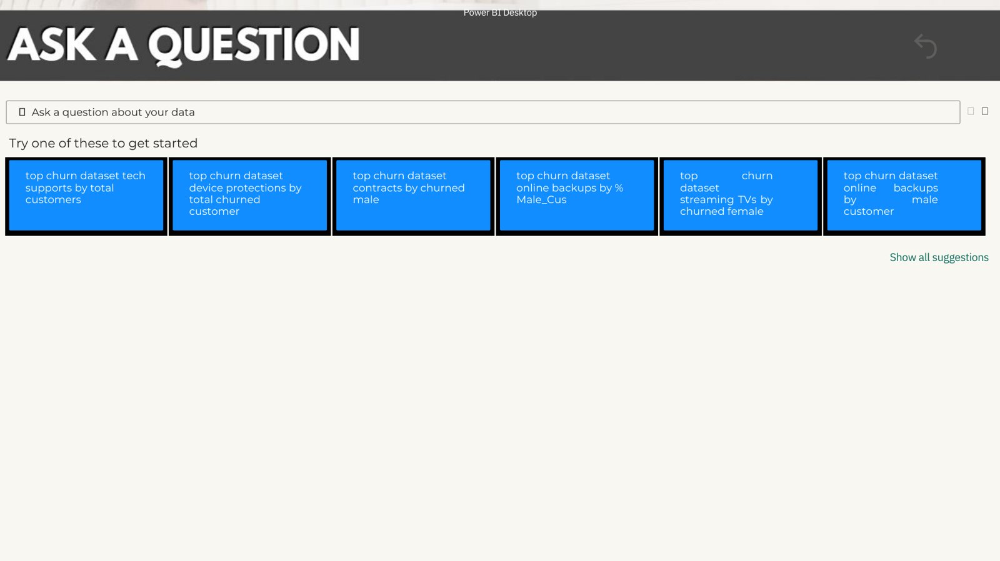
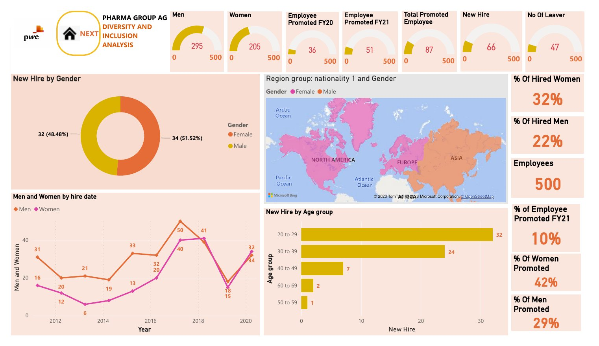
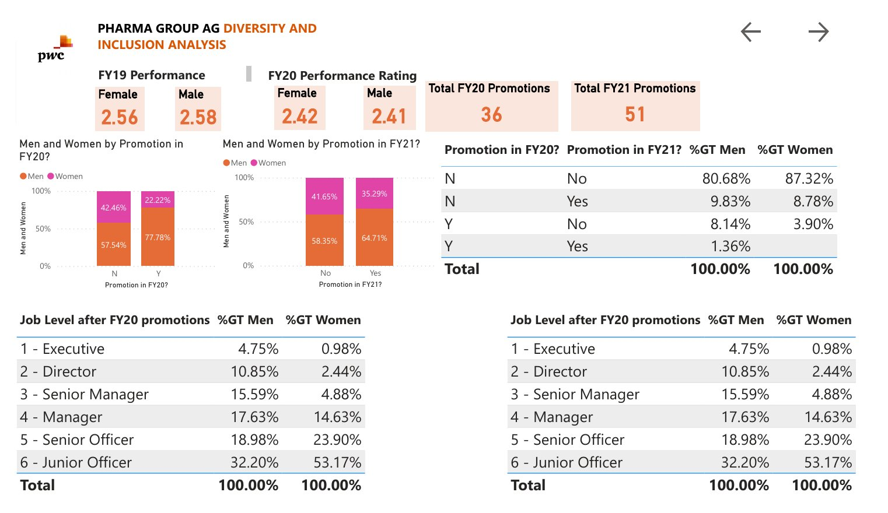
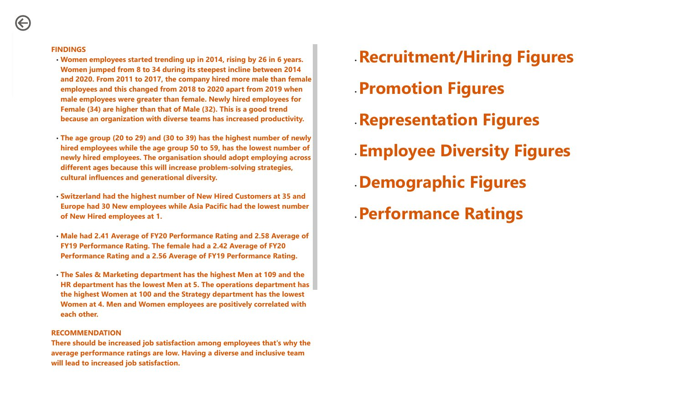

# PwC Switzerland – Power BI Job Simulation



Two interactive **Power BI** dashboards built for the **PwC Switzerland Power BI Job Simulation on Forage** (completed September 2023): one on **customer churn and retention** for a telecom client, and one on **diversity & inclusion** for a pharmaceutical client.

**Tools:** Power BI Desktop · DAX · Power Query · Q&A visual · report navigation with bookmarks and buttons

---

## 1. Customer Churn Retention Analysis (Telco)

**Business question:** Which customers are leaving, and what should the retention team focus on?

| Page | What it shows |
|---|---|
| **Home** | Navigation hub linking to each report page |
| **Summary** | Side-by-side profile of **all 7,043 customers** vs **1,869 churned customers** (≈26.5% churn) across demographics, services, contracts, tenure and payment method |
| **Customer Details** | Drill-through by Customer ID showing that customer's profile, services and contract, next to the retention recommendations |
| **Ask a Question** | Power BI Q&A so stakeholders can query the data in plain English |

<table><tr>
<td></td>
<td></td>
<td></td>
</tr></table>

### Key findings
- **Contract type is the biggest driver:** 1,655 of the 1,869 churned customers were on **month-to-month** contracts, compared with 166 on one-year and 48 on two-year contracts.
- **New customers churn most:** customers with **0–10 months of tenure** are the most likely to leave.
- **Fibre-optic internet users churn heavily:** 1,297 churned customers had fibre optic, against 459 on DSL.
- **Payment method matters:** 1,071 churned customers paid by **electronic check**.
- **Weak add-on services:** most churned customers had **no online security** (1,461) and no device protection.

### Recommendations
1. Offer attractive packages that move month-to-month customers onto longer contracts.
2. Run an onboarding and retention programme for customers in their first 10 months.
3. Look into service quality and pricing for fibre-optic customers.
4. Encourage automatic payment methods over electronic check.

---

## 2. Diversity & Inclusion Analysis (Pharma Group AG)

**Business question:** How is the company doing on gender balance in hiring, promotion, representation and performance?



| Metric | Value |
|---|---|
| Employees | 500 (295 men · 205 women) |
| New hires | 66 (34 women · 32 men) |
| Leavers | 47 |
| Promotions | 36 in FY20 · 51 in FY21 |
| Avg. performance rating FY20 | Women 2.42 · Men 2.41 |

<table><tr>
<td></td>
<td></td>
</tr></table>

### Key findings
- **Hiring has become more balanced:** female hires rose steeply from 2014 to 2020, and recent hires slightly favour women (34 vs 32).
- **Leadership gap:** women make up only **0.98% at Executive level** (men 4.75%) and 2.44% at Director level, but **53% of Junior Officers**.
- **Performance is equal:** average ratings for men and women are almost identical, so the promotion gap is not explained by performance.
- **Hiring is concentrated by age:** most new hires are 20–39, with very few over 50.
- **Department imbalance:** Sales & Marketing has the most men, while Operations has the most women.

### Recommendation
Build a fair promotion pipeline into senior roles for women, track representation by level each year, and widen hiring across age groups.

---

## Repository structure

```
pbix/          Power BI source files (open in Power BI Desktop)
pdf/           PDF exports of both dashboards + churn presentation
images/        Dashboard screenshots
certificate/   Forage completion certificate
```

## About this project
This was a virtual job simulation run by PwC Switzerland on [Forage](https://www.theforage.com). It is not employment at PwC. The datasets were provided as part of the programme.

**Author:** Muhammad Usman Khan · [Portfolio](https://data-meta.github.io) · [LinkedIn](https://www.linkedin.com/in/muhammad-usman-khan-data-analyst/) · [GitHub](https://github.com/DATA-Meta)
